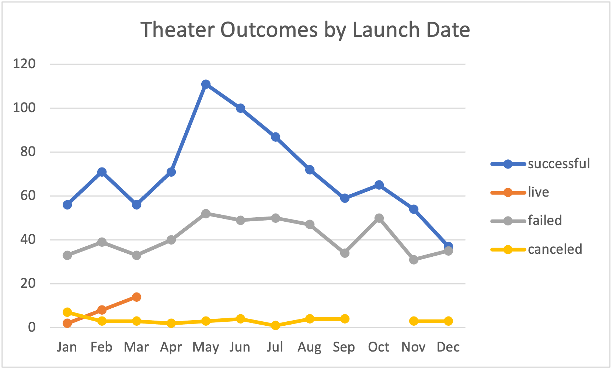
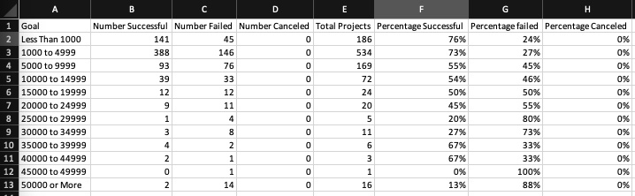
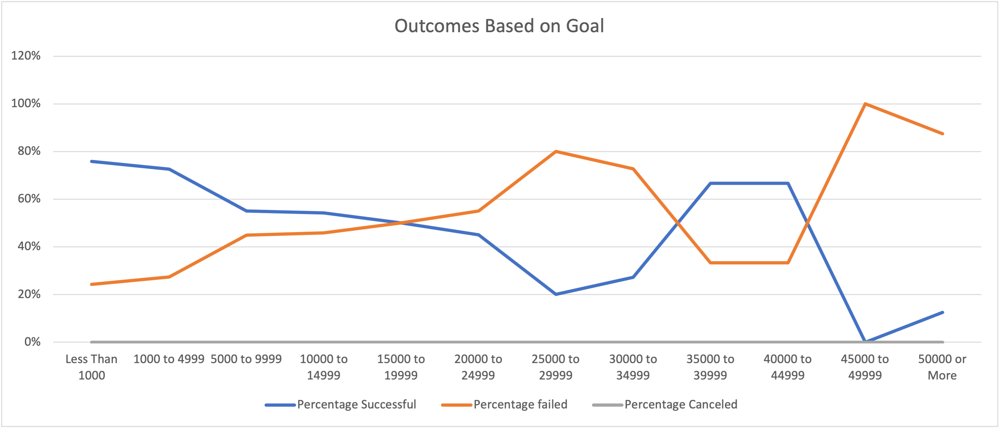
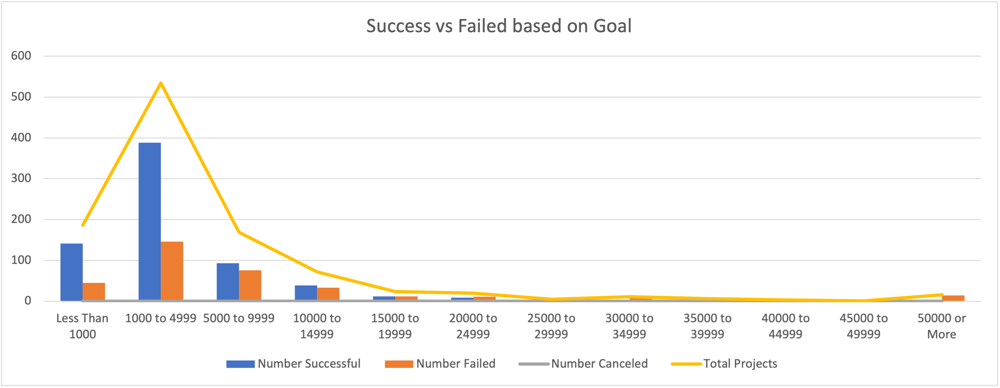

# Kickstarting with Excel
  
## Overview of Project

### Purpose

The Purpose of this analysis is to provide the client information on how different campaigns fared in relation to their launch dates and their funding goals. Using a dataset provided by Kickstarter and Excel we will visualize different campaign outcomes and show how they behave depending on the start date throughout the year, as well as the rate of each outcome depending on the Goal of the campaign.

With these visualizations we will provide the client a study of if the success or failure of different campaigns has any relation to their launch dates and/or funding goals.

## Analysis and Challenges

### Analysis of Outcomes Based on Launch Date

For this analysis we created a pivot table using the Kickstarted dataset. Fist we added a Year column using the =Year() formula and the "Date Created Conversion" column. With this column we were able to include in the pivot table a filter for Year as well as Parent Category. Using the filter for Theatre we are able to see the outcome of the campaigns depending on their outcome. Looking at the outcomes of Theater campaigns throughout the year and comparing them between the successful, failed and canceled campaigns we can see that campaigns have a higher chance of succeeding if they are launched during the month of May, June and July. Also, February, April, August and September have a high success rate but when comparing them to the failed campaigns the difference is not so significant. 

Looking at the graph you can see that there is a relatively high number of successful campaigns on the months of February, April, August and September. But in comparison with the failed campaigns, we can see that close to 40 out of 100 campaigns are canceled or fail. On the other hand, looking at May, June and July the number of successful campaigns increases considerably while the failed campaigns keep stable.

### Analysis of Outcomes Based on Goals

For this analysis we used the =COUNTIFS() formula to create a table where we could see the number of successful, filed and canceled plays. Then using the =SUM() formula we can add the totals of each to see the Total number of projects for each Goal range. After getting the total number of projects we can calculate the % of projects that either fail or succeed on each Goal range.

On the line graph below we are taking into consideration the number of successful, failed and canceled campaigns backing plays and looking at them in relation to the Goal set for each campaign. 

We can instantly see that there were no canceled projects and so the graph shows only successful and failed campaigns. Looking at the percentage successful line (blue) we can see that as the Goal of the campaign grows the percentage of success is less, but that changes once the Goal is set over $20,000. There is no set pattern for the bigger Goals.

Taking into account this graph it is difficult to ascertain any type of pattern because we can only see a mirror behavior on the failed and successful campaigns.

### Challenges and Difficulties Encountered

For this first Analysis a pivot table was used for the whole data set provided, no mayor challenges were encountered the only difficulty is that we could take into account for this type of analysis would be to add the year into the comparison as well. The data is for a span of almost 10 years, but from 2009 to 2013 there is almost no campaigns. When adding new data for upcoming years, considering these as outliers based on the year could help the analysis be more accurate.

On the second analysis there was a challenge. The graph created didn't really show enough information to provide the client with a concrete solution on how to approach a campaign. With this information it would be more useful to generate a bar graph showing the number of successful and failed projects on each Goal bracket. With this graph it would be easier for us to say that setting a lower goal is definitely the way to go, as the number of higher goal campaigns is not enough to do a deep dive analysis.

## Results

- What are two conclusions you can draw about the Outcomes based on Launch Date?

    In conclusion, with this analysis we can see that theatre is more successful if the campaign is launched during the months of May, June and July.
    Also, the majority of the campaigns for theatre succeed but more information needs to be taken into account to ascertain exactly why some succeed and others don't. Maybe the set Goal?

- What can you conclude about the Outcomes based on Goals?

    The line graph we made using percentages is not useful information. Since there are no cancelled projects there is only two options and this causes the lines in the graph to be the mirror of each other, since the percentage always adds up to 100% the relationship between failed and successful will always be the subtraction of each other to 100%. It also doesn't show the number of projects that are affecting the numbers, so it could be 500 shows or only 2 or 3. With this information we can't tell accurately if the trends are there or not.

- What are some limitations of this dataset?

    Some of the limitations that I found with this dataset are the lack of differentiation between projects that are geolocked (limited to one city, like food trucks and theatre plays) and projects that are not (like music or tabletop games that can be played everywhere). Also, the data set is limited to the one table, making different tables for different categories might make the data easier to interpret.

- What are some other possible tables and/or graphs that we could create?

    I added above a line graph to better understand the number of successful vs failed projects based on Goal, with this graph it is easier to see the number of projects that actually took place for each goal bracket.

    Another graph that can be useful is a line graph that shows the total of projects done for each category, and then for each subcategory so that we can see in which a Kickstarter is more successful and find points of improvement where there is more failure.
